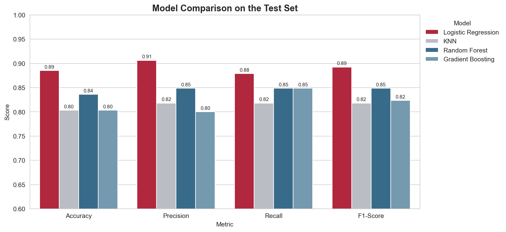
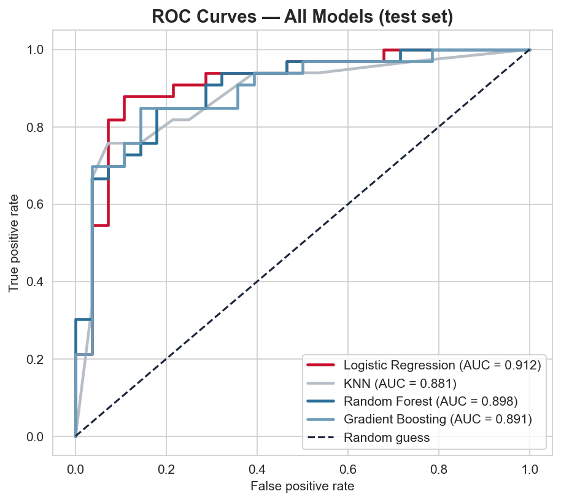
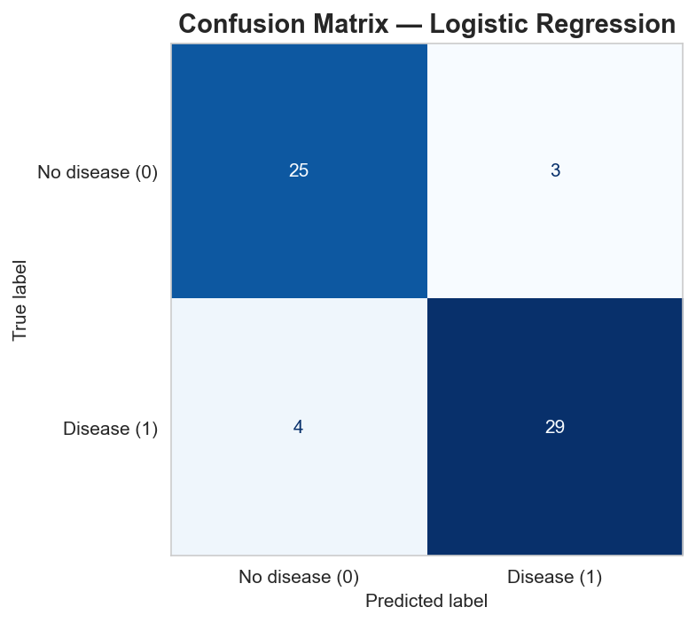
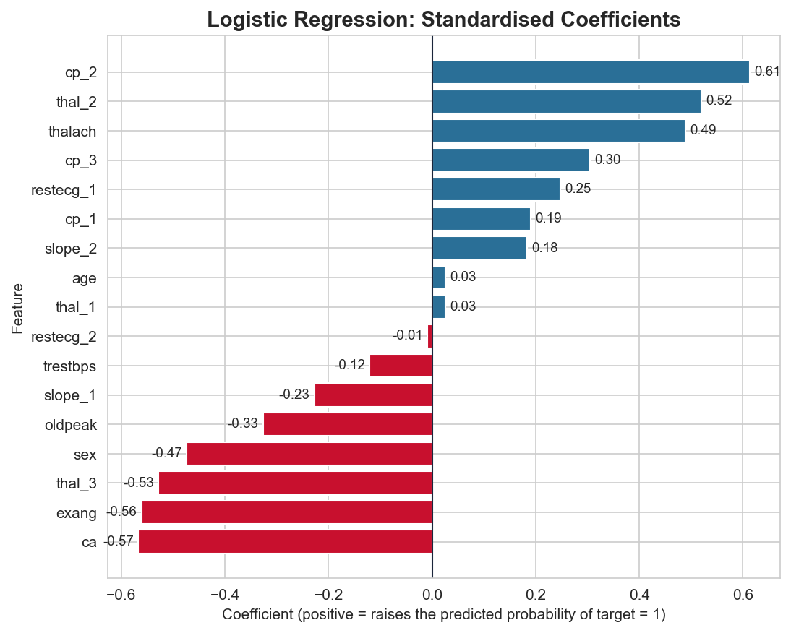

# ❤️ Heart Disease Prediction — Machine Learning Classification

An end-to-end machine learning project in **Python (scikit-learn)**. Acting as an ML engineer, I build, tune and compare **four classification models** that predict heart disease from routine clinical measurements, and recommend the best one.

📓 **Main deliverable:** [`Heart_Disease_ML.ipynb`](Heart_Disease_ML.ipynb) (fully executed, all outputs and charts included)

## Dataset
- **Source:** [Heart Disease Dataset](https://www.kaggle.com/datasets/johnsmith88/heart-disease-dataset) on Kaggle (`heart.csv`), derived from the UCI Cleveland Heart Disease data
- **Size:** 1,025 rows × 14 columns, **but only 302 unique records** (see below)
- **Target:** `target`, a binary heart-disease label

## ⚠️ Key Data-Quality Finding
**723 of the 1,025 rows (70%) are exact duplicates.** With a normal train/test split, copies land on both sides and the model is tested on rows it has memorised:

| Dataset | Rows | Random Forest test accuracy |
|---|---|---|
| Raw (with duplicates) | 1,025 | **100%** (leaked) |
| De-duplicated | 302 | **75.4%** (honest) |

All results below use the de-duplicated data.

## Workflow
| Step | What was done |
|---|---|
| 1. Load, Explore, Preprocess | Missing-value and duplicate checks, one-hot encoding of nominal features, scaling, stratified 80/20 split, every decision explained |
| 2. Feature Engineering | Correlation analysis + Random Forest importance; dropped `fbs` and `chol`, validated with cross-validation |
| 3. Train 4 Models | Logistic Regression, KNN, Random Forest, Gradient Boosting, each in a `Pipeline` and tuned with `GridSearchCV` (5-fold, F1) |
| 4. Evaluate & Compare | Accuracy, Precision, Recall, F1, ROC-AUC on the test set, plus repeated-CV robustness check |
| 5. Best Model & Conclusion | Confusion matrix, classification report, coefficients, saved model, 5-line conclusion |

## Results (held-out test set, n = 61)
| Model | Accuracy | Precision | Recall | F1 | ROC-AUC |
|---|---|---|---|---|---|
| **Logistic Regression** | **0.885** | **0.906** | **0.879** | **0.892** | **0.912** |
| Random Forest | 0.836 | 0.848 | 0.848 | 0.848 | 0.898 |
| Gradient Boosting | 0.803 | 0.800 | 0.848 | 0.824 | 0.891 |
| KNN | 0.803 | 0.818 | 0.818 | 0.818 | 0.881 |

**Best model: Logistic Regression.** It caught 29 of 33 disease cases (4 missed, 3 false alarms). With only 241 training records and mostly monotonic clinical relationships, a regularised linear model beats more flexible models that overfit.

| | |
|---|---|
|  |  |
|  |  |

## How to Run
```bash
git clone https://github.com/<your-username>/heart-disease-ml-project.git
cd heart-disease-ml-project
pip install -r requirements.txt
jupyter notebook Heart_Disease_ML.ipynb
```

## Repository Structure
```
heart-disease-ml-project/
├── Heart_Disease_ML.ipynb   # full analysis (executed)
├── data/heart.csv
├── images/                  # exported charts
├── models/best_model.joblib # saved best pipeline
├── requirements.txt
└── README.md
```

## Limitations
- Only 302 unique records, so the 61-patient test set gives wide confidence intervals and small gaps between models are within noise.
- The `target` coding should be checked against the source documentation: several risk factors correlate negatively with `target = 1`.
- A screening-aid prototype only; it needs external validation before any real-world use.

## Tech Stack
Python · scikit-learn · Pandas · NumPy · Matplotlib · Seaborn · Jupyter
